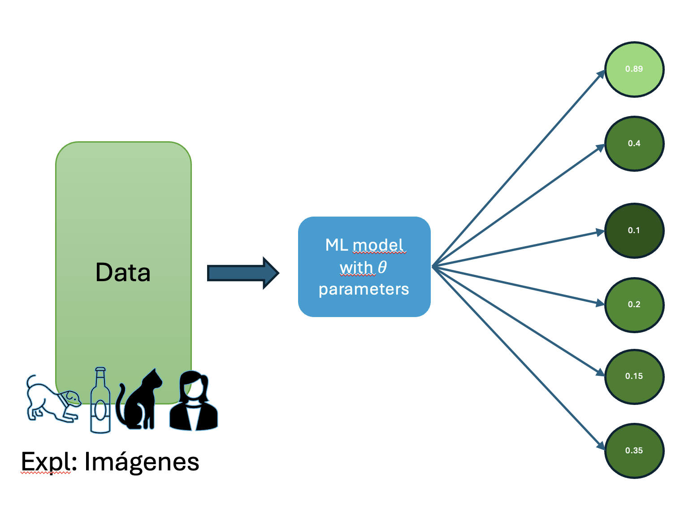
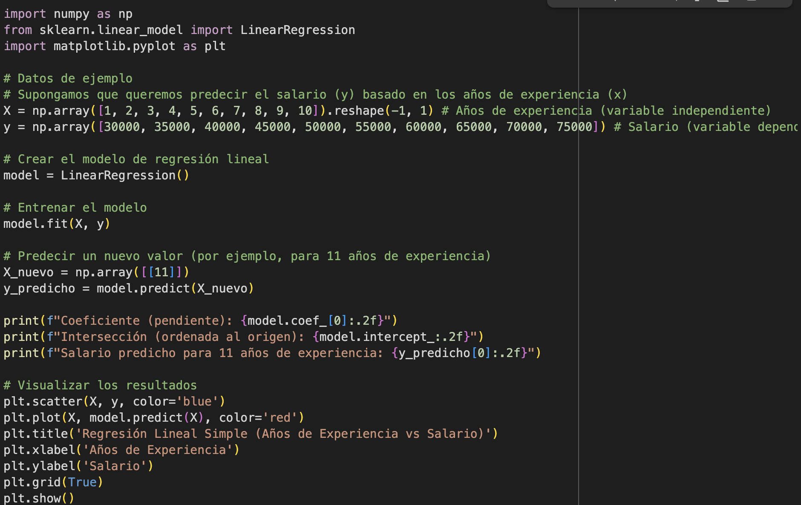

# Tipos de Machine learning

Los sistemas de Machine learning(ML) se dividen en una o más de las siguientes categorías, dependiendo de como aprenden y los datos que generan

* Aprendizaje supervisado **(SL)**
* Aprendizaje No supervisado **(NSL)**
* Apremdizaje por refuerzo **(RL)**

## Aprendizaje supervisado

Los modelos de *ML* realizan predicciones después de analizar una cantidad significativa de datos que ya contienen las respuestas correctas. Luego, descubren las conexiones entre los elementos que producen dichas respuestas.

Es como un estudiante que aprende material nuevo revisando exámenes anteriores que contienen las preguntas y sus respectivas respuestas. Una vez que el estudiante se ha entrenado con suficientes exámenes, estará bien preparado para realizar examenes nuevos.

Se dice que estos sistemas están *supervisados* por que al sistema *ML* se le proporcionan los datos con los resultados conocidos.

Los casos más comunes de aprendizaje supervisado son:

### Regresión

Estos modelos predicen **valores numéricos**. Por ejemplo, un modelo meteorológico que predice la cantidad de lluvia, en pulgadas o milímetros, es un modelo de regresión.

---

!!! note "Algunos ejemplos de regresión ✍️."

    | Área de Aplicación | Ejemplo Específico | Variable a Predecir (Salida Numérica) |
    | :--- | :--- | :--- |
    | **Negocios / Ventas** | Predecir las ventas totales para el próximo trimestre basándose en el gasto en publicidad y la estacionalidad. | Ingresos en pesos (ej. $500,000,000) |
    | **Logística** | Estimar el tiempo de entrega de un paquete considerando la distancia, el peso del producto y la ruta. | Tiempo en horas (ej. 72.5 horas) |
    | **Recursos Humanos** | Determinar el salario justo para un nuevo candidato basándose en su experiencia, educación y el rol al que aplica. | Salario anual en pesos (ej. $95,000,000) |
    | **Negocios / Marketing** | Calcular el valor de vida de un cliente (Customer Lifetime Value) para enfocar los esfuerzos de retención. | Valor total en pesos que un cliente gastará (ej. $1,200,000) |
    | **Logística / Operaciones**| Optimizar los niveles de inventario para un producto y así evitar el exceso o la falta de stock. | Número de unidades a ordenar (ej. 850 unidades) |

### Clasificación

Predicen la provabilidad de que algo pertenezca a una categoría dada. A diferencia de los modelos de regresión en donde los resultados son un número, los modelos de clasifícación genera que tanto algo pertenece o no a una categoría.

Se pueden utilizar modelos de clasificación para predecir si un correo electrónico es spam o si una foto es de una vaca, gato o perro.

Los modelos de clasificación se dividen en dos grupos, clasificación binaria y clasificación multiclase. Las clasificación binaria predice un resultado entre dos categorías posibles, por ejemplo *llover* o *no llover*. Por otro lado, los modelos de clasificación multiclase predicen un resultado des entre varias categorias, por ejemplo, un modelo puede mostrar *lluvia*, *sequía*, *nieve* o *niebla*.

!!! video "🎥 Video: Clasificación binaria"

    <iframe width="100%" height="315" 
    src="https://www.youtube.com/embed/6Gcb-LlelvI" 
    frameborder="0" allowfullscreen></iframe>

!!! example "📷 Imagen: Clasificación binaria"

    { width="100%" }

!!! note "Algunos ejemplos de clasificación ✍️."

    | Área de Aplicación | Ejemplo Específico | Tipo de Clasificación | Posibles Predicciones (Clases) |
    | :--- | :--- | :--- | :--- |
    | **Recursos Humanos** | Predecir si un empleado clave abandonará la empresa en el próximo año. | **Binaria** | `Sí Abandonará` / `No Abandonará` |
    | **Negocios (Finanzas)**| Detectar si una transacción con tarjeta de crédito es fraudulenta. | **Binaria** | `Fraude` / `No Fraude` |
    | **Logística** | Determinar si un envío llegará a tiempo a su destino final. | **Binaria** | `A Tiempo` / `Retrasado` |
    | **Negocios (Marketing)**| Predecir si un usuario potencial convertirá (comprará) después de una campaña. | **Binaria** | `Convertirá` / `No Convertirá` |
    | **Negocios (Clientes)**| Clasificar a un cliente según su nivel de satisfacción a partir de una reseña escrita. | **Multiclase** | `Satisfecho` / `Neutral` / `Insatisfecho` |
    | **Logística** | Identificar el estado actual de un paquete en el sistema de seguimiento. | **Multiclase** | `En Tránsito` / `En Entrega` / `Entregado` / `Devuelto` |
    | **Recursos Humanos** | Asignar una calificación de desempeño a un empleado al final del año. | **Multiclase** | `Supera Expectativas` / `Cumple` / `Necesita Mejorar` |
    | **Logística** | Recomendar el tipo de servicio de envío más adecuado para un paquete. | **Multiclase** | `Estándar` / `Express` / `Prioritario` / `Internacional` |

## Aprendizaje No supervisado

Por otro lado, en este tipo de modelos, se realizan predicciones con datos que no tienen *respuestas correctas*. El objetivo de estos modelos es identificar patrones entre los datos. Dicho de otro modo, el modelo no tiene pistas de cómo debe relacionar cada dato, sino que deberá inferir sus propias reglas.

Una de las técnicas más comunes es la agrupación(*clustering*). Este método se encarga de encontrar agrupaciones naturales en un conjunto de datos.

!!! tip "Abre el Notebook en Google Colab"

    Para ejecutar el código y experimentar por tu cuenta, puedes abrir el cuaderno de práctica directamente en Google Colab.

    [➡️ **Abrir Notebook Interactivo **](https://colab.research.google.com/drive/1B182noYsWkaOL8WZSYHBElJAf1pS8kCn?usp=sharing)

## Aprendizaje por refuerzo

En estos modelos, se realizan predicciones a partir de una función de recompensa o castigo sobre las acciones y los estados del agente.

El objetivo de estos sistemas es lograr alcanzar una politica de estado acción optima que permita obtener la mayor recompensa acomulada o minimizar el castigo.

!!! note "Algunos ejemplos de Aprendizaje por refuerzo ✍️."

    | Área de Aplicación | Agente (El que aprende) | Entorno (Donde actúa) | Objetivo (Maximizar la Recompensa) |
    | :--- | :--- | :--- | :--- |
    | **Juegos** | Un programa de IA (como AlphaGo de DeepMind). | Las reglas y el tablero del juego (Go, ajedrez). | Ganar la partida. |
    | **Robótica** | El sistema de control de un brazo robótico. | Un almacén o una línea de ensamblaje física. | Agarrar y mover objetos con éxito sin dejarlos caer. |
    | **Sistemas Autónomos** | El software de conducción de un vehículo. | El tráfico, las carreteras y las señales de tránsito. | Llegar al destino de forma segura y en el menor tiempo posible. |
    | **Optimización** | El termostato inteligente de una casa (como Nest). | El hogar y los patrones de comportamiento del usuario. | Ahorrar energía manteniendo un nivel de confort para el usuario. |
    | **Finanzas** | Un algoritmo de *trading* automático. | El mercado de valores en tiempo real. | Obtener el máximo beneficio económico de las operaciones. |

!!! tip "Abre el Notebook en Google Colab"

    Para ejecutar el código y experimentar por tu cuenta, puedes abrir el cuaderno de práctica directamente en Google Colab.

    [➡️ **Abrir Notebook Interactivo **](https://colab.research.google.com/drive/1mxGpans8UlVIbP-Rqo1xtNfRvlmSwnpS?usp=sharing)

## Inteligencia artificial generativa.

La inteligencia artificial generativa es una clase de modelo que *genera* contenido a partir de entradas de usuario. Por ejemplo, la IA generativa puede crear imágenes, composiciones musicales y chistes; puede resumir artículos, explicar cómo realizar una tarea o editar una foto.

Los modelos generativos más modernos pueden tomar una variedad importante de entradas y crear una variedad de salidas, como texto,imágenes, audio y video. Por ejemplo, un modelo puede tomar una imagen como entrada y crear una imagen y texto como salida, o tomar una imagen y texto como entrada y crear un video como salida.

Algunas entradas y salidas de los modelos generativos son:

* Texto a texto
* Texto a imagen
* Texto a video
* Texto a código
* Texto a voz
* Imagen y texto a imagen

.

!!! note "Algunos ejemplos de entrada y salida de modelos generativos ✍️."

    | Modelo | Entrada | Ejemplo de resultado | 
    | :--- | :--- | :--- | 
    |Texto a texto     |¿Quién es Simón bolívar?     | Simón Bolívar (1783-1830) fue un líder revolucionario venezolano conocido como "El Libertador" por su papel fundamental en la independencia de varios países sudamericanos del Imperio Español...     |
    |Texto a imagen     | Genera una imagen de Elonk musk indignado viendo los precios de la mojarra en Baru Cartagena      |{ width="40%" }     |
    |Texto a video     | 'An astronaut riding a horse.'     | { width="40%" }     |
    |Texto a código     | Genera un ejemplo simple de regresión lineal simple con sklearn scikit-learn | { width="40%" }    |

¿Cómo funciona la IA generativa? En un nivel alto, los modelos generativos aprenden patrones en los datos con el objetivo de producir datos nuevos, pero similares. Los modelos generativos son los siguientes:

* Los comediantes que aprenden a imitar a otras personas observando su comportamiento y estilo de hablar
* Artistas que aprenden a pintar en un estilo particular estudiando muchas pinturas de ese estilo
* Bandas tributo que aprenden a sonar como un grupo musical específico escuchando mucho de su música

Para producir resultados únicos y creativos, los modelos generativos se entrenan inicialmente con un enfoque no supervisado, en el que el modelo aprende a imitar los datos en los que se entrena. A veces, el modelo se entrena más con el aprendizaje supervisado o de refuerzo en datos específicos relacionados con las tareas que se le podrían pedir, por ejemplo, resumir un artículo o editar una foto.

La IA generativa es una tecnología que evoluciona rápidamente y se descubren nuevos casos de uso constantemente. Por ejemplo, los modelos generativos ayudan a las empresas a definir mejor sus imágenes de productos de comercio electrónico quitando automáticamente los fondos que distraen o mejorando la calidad de las imágenes de baja resolución.

!!! tip "💡 Términos Clave de la Lección"

    1.  **Aprendizaje Supervisado (SL):** Modelos que aprenden de datos que ya tienen las "respuestas correctas" o etiquetas.
    2.  **Aprendizaje No Supervisado (NSL):** Modelos que encuentran patrones y estructuras en datos sin etiquetar.
    3.  **Aprendizaje por Refuerzo (RL):** Modelos que aprenden tomando acciones en un entorno para maximizar una recompensa.
    4.  **Regresión:** Un tipo de aprendizaje supervisado que predice un valor numérico continuo (ej. el precio de una casa).
    5.  **Clasificación:** Un tipo de aprendizaje supervisado que predice una categoría (ej. si un correo es spam o no).
    6.  **Clasificación Binaria:** Un modelo de clasificación que elige entre solo dos posibles resultados (ej. `Fraude` / `No Fraude`).
    .  **Clasificación Multiclase:** Un modelo de clasificación que elige entre más de dos posibles resultados (ej. `Satisfecho` / `Neutral` / `Insatisfecho`).
    8.  **Agrupación (Clustering):** La técnica más común de aprendizaje no supervisado para encontrar grupos naturales en los datos.
    9.  **Agente:** En el aprendizaje por refuerzo, es la entidad que aprende a tomar decisiones (ej. un programa que juega ajedrez).
    10. **IA Generativa:** Una clase de modelos que se especializan en crear contenido nuevo y original, como texto, imágenes o código.

¡Es hora de poner a prueba lo que has aprendido! Responde la siguiente pregunta directamente aquí en la página.

<iframe src="https://docs.google.com/forms/d/e/1FAIpQLSeVG-JQW-InBGDzBkLPm3nSQy68tovYT_z0evTqLFOJztY1mQ/viewform?embedded=true" width="640" height="3022" frameborder="0" marginheight="0" marginwidth="0">Cargando…</iframe>

¡Excelente trabajo! Ahora continuemos con el siguiente tema.

## Bibliografía

> Wu, C., et al. (2025). *Qwen-Image Technical Report*. Recuperado de: https://arxiv.org/abs/2508.02324

[Siguiente: Aprendizaje supervisado &rarr;](semana-1-2.md)

[O saltar a: Herramientas de Trabajo para el curso &rarr;](semana-1-herramientas.md)
